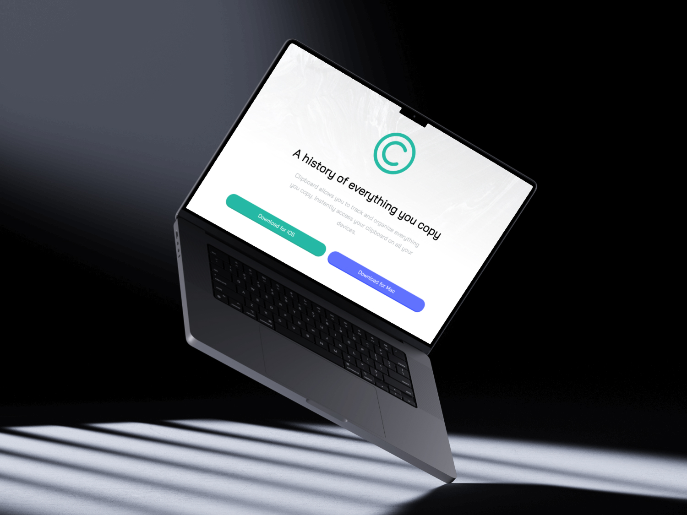

# 📋 Clipboard Landing Page




---

## 🚀 Project Overview

This is a **learning project** that demonstrates modern web development techniques through a beautiful, responsive landing page for a clipboard management application. The project showcases clean HTML5, CSS3, and JavaScript implementation with smooth animations and mobile-first design principles.

### 🎯 Learning Objectives

- **Responsive Web Design**: Mobile-first approach with CSS Grid and Flexbox
- **Modern CSS**: Custom properties, animations, and media queries
- **JavaScript DOM Manipulation**: Dynamic content and responsive behavior
- **Animation Libraries**: Integration with AOS (Animate On Scroll) library
- **Font Integration**: Custom font loading and typography
- **Image Optimization**: Responsive images and proper asset management

---

## ✨ Features

### 🎨 Design & User Experience
- **Responsive Design**: Seamlessly adapts to all screen sizes (mobile, tablet, desktop)
- **Smooth Animations**: AOS library integration for engaging scroll animations
- **Modern UI/UX**: Clean, professional design with intuitive navigation
- **Custom Typography**: Beautiful custom font integration

### 📱 Technical Features
- **Mobile-First CSS**: Optimized for mobile devices with progressive enhancement
- **Dynamic Background**: JavaScript-powered responsive background switching
- **Cross-Browser Compatibility**: Works across all modern browsers
- **Performance Optimized**: Efficient CSS and JavaScript implementation

### 🔧 Functionality
- **Interactive Elements**: Hover effects and smooth transitions
- **Responsive Navigation**: Mobile-friendly navigation system
- **Social Media Integration**: Direct links to developer's social profiles
- **Download Buttons**: Call-to-action buttons for app downloads

---

## 🛠️ Technologies Used

| Technology | Purpose | Version |
|------------|---------|---------|
| **HTML5** | Semantic markup and structure | Latest |
| **CSS3** | Styling, animations, and responsive design | Latest |
| **JavaScript (ES6+)** | Interactive functionality and DOM manipulation | Latest |
| **AOS Library** | Scroll animations and effects | 2.3.1 |
| **Font Awesome** | Icons and social media symbols | Latest |
| **Custom Font** | Typography (bin.ttf) | Custom |

---

## 📁 Project Structure

```
Clipboard_P/
├── 📁 css/
│   └── style.css              # Main stylesheet with responsive design
├── 📁 font/
│   └── bin.ttf                # Custom font file
├── 📁 img/
│   ├── 📁 bg/                 # Background images
│   │   ├── bg-header-desktop.png
│   │   └── bg-header-mobile.png
│   ├── 📁 clints/             # Client logos
│   │   ├── logo-google.png
│   │   ├── logo-hp.png
│   │   ├── logo-ibm.png
│   │   ├── logo-microsoft.png
│   │   └── logo-vector-graphics.png
│   ├── 📁 svg/                # SVG icons
│   │   ├── icon-blacklist.svg
│   │   ├── icon-facebook.svg
│   │   ├── icon-instagram.svg
│   │   ├── icon-preview.svg
│   │   ├── icon-text.svg
│   │   ├── icon-twitter.svg
│   │   └── logo.svg
│   ├── image-computer.png
│   ├── image-devices.png
│   ├── LOGO.png
│   └── mockup.jpg
├── 📁 js/
│   ├── all.min.js             # Font Awesome library
│   └── index.js               # Main JavaScript functionality
├── index.html                 # Main HTML file
└── README.md                  # Project documentation
```

---

## 🚀 Getting Started

### Prerequisites
- A modern web browser (Chrome, Firefox, Safari, Edge)
- A local web server (optional, for development)

### Installation & Setup

1. **Clone the repository**
   ```bash
   git clone https://github.com/Practice-Projectes/Clipboard.Website.git
   cd Clipboard_P
   ```

2. **Open the project**
   - **Option 1**: Open `index.html` directly in your browser
   - **Option 2**: Use a local server for development
     ```bash
     # Using Python
     python -m http.server 8000
     
     # Using Node.js (if you have http-server installed)
     npx http-server
     
     # Using PHP
     php -S localhost:8000
     ```

3. **View the project**
   - Navigate to `http://localhost:8000` (if using a server)
   - Or simply open `index.html` in your browser

---

## 📱 Responsive Breakpoints

The project uses a mobile-first approach with the following breakpoints:

- **Mobile**: `< 767px` - Single column layout, mobile-optimized navigation
- **Tablet**: `767px - 990px` - Adjusted layouts for medium screens
- **Desktop**: `> 990px` - Full desktop layout with side-by-side content
- **Large Desktop**: `> 1200px` - Maximum container width for large screens

---

## 🎨 Key Sections

### 1. **Hero Section**
- Eye-catching header with call-to-action buttons
- Responsive background images
- Animated logo and text elements

### 2. **Features Section**
- Three-column layout showcasing app features
- Icon-based feature presentation
- Smooth scroll animations

### 3. **Client Logos**
- Trusted company logos
- Responsive grid layout
- Animated logo reveals

### 4. **Download Section**
- Clear call-to-action for app downloads
- Platform-specific download buttons
- Consistent branding

### 5. **Footer**
- Social media links
- Navigation links
- Contact information

---

## 🔧 Customization

### Colors
The project uses a consistent color palette defined in CSS:
- **Primary Green**: `#26baa4`
- **Secondary Blue**: `#6173ff`
- **Text Gray**: `#bfc3c6`
- **Background Gray**: `#f5f6f8`

### Fonts
- **Custom Font**: `bin.ttf` (loaded via @font-face)
- **Fallback**: Tahoma for body text

### Animations
- **AOS Library**: Scroll-triggered animations
- **CSS Transitions**: Hover effects and smooth interactions
- **Custom Animations**: Button interactions and element reveals

---

## 📚 Learning Outcomes

This project demonstrates proficiency in:

- ✅ **HTML5 Semantic Structure**
- ✅ **CSS3 Advanced Features** (Flexbox, Grid, Animations)
- ✅ **Responsive Web Design**
- ✅ **JavaScript DOM Manipulation**
- ✅ **Third-party Library Integration**
- ✅ **Performance Optimization**
- ✅ **Cross-browser Compatibility**
- ✅ **Mobile-first Development**

---

## 🤝 Contributing

This is a learning project, but contributions and suggestions are welcome! Feel free to:

- Report bugs or issues
- Suggest improvements
- Share your own implementations
- Provide feedback on the code

---

## 📞 Connect with the Developer

<div align="center">
  
  [](https://www.instagram.com/_0mo___)
  [](https://www.linkedin.com/in/0mo8/)
  [](https://github.com/0mo8)
  [](mailto:hi@mohhusayn.dev)
  [](https://wa.me/+9647762444497)
  
</div>

---

## 📄 License

This project is created for educational purposes. Feel free to use it as a learning resource or starting point for your own projects.

---

## 🙏 Acknowledgments

- **Frontend Mentor** - For the original design challenge
- **AOS Library** - For the smooth scroll animations
- **Font Awesome** - For the beautiful icons
- **All Contributors** - For feedback and suggestions

---

<div align="center">
  <p><strong>Made with ❤️ for learning and sharing knowledge</strong></p>
  <p>⭐ Star this repository if you found it helpful!</p>
</div>
